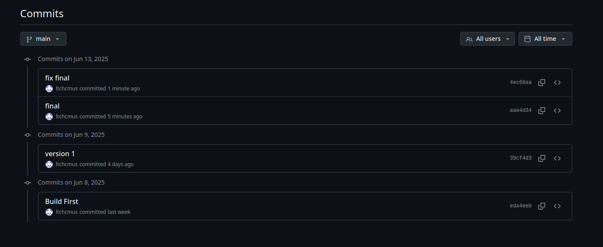

# Dự án: Trình diễn các Kỹ thuật C++ Hiện đại (C++17 - C++23)

# Thông tin sinh viên
    MSSV: 23120222
    Họ tên: Lê Thành Công
    Tài khoản github: ltchcmus

---

# Lược đồ commit


---

# Nội dung sản phẩm
## 1. Giới thiệu
Dự án này giúp trải nghiệm các kỹ thuật nổi bật của C++ hiện đại (từ C++17 đến C++23) qua giao diện dòng lệnh. Mỗi kỹ thuật đều có lý thuyết, ví dụ thực tế, giải thích chi tiết luồng chạy, và có thể chạy thử trực tiếp.

## 2. Mục tiêu
- Hiểu rõ bản chất, ứng dụng thực tế của từng kỹ thuật C++ mới.
- Thực hành code demo, quan sát kết quả và phân tích chi tiết luồng chạy.


## 3. Danh sách 10 kỹ thuật nổi bật (C++17–C++23)

| STT | Kỹ thuật                | Phiên bản |
|-----|-------------------------|-----------|
| 1   | Structured Bindings     | C++17     |
| 2   | if constexpr           | C++17     |
| 3   | std::optional          | C++17     |
| 4   | std::variant           | C++17     |
| 5   | Inline Variables       | C++17     |
| 6   | Concepts               | C++20     |
| 7   | Coroutines             | C++20     |
| 8   | Ranges                 | C++20     |
| 9   | Spaceship Operator     | C++20     |
| 10  | std::expected          | C++23     |

---

## 4. Phân tích chi tiết từng kỹ thuật

### 1. Structured Bindings (C++17)
- **Khái niệm:** Structured bindings cho phép "bóc tách" nhiều giá trị từ tuple, pair, array, struct thành các biến riêng biệt chỉ với một dòng lệnh.
- **Chức năng:** Gán nhiều biến cùng lúc, giúp code ngắn gọn, rõ ràng.
- **Công dụng:**
  - Lấy nhiều giá trị trả về từ hàm (ví dụ: truy vấn DB trả về tuple)
  - Duyệt map, pair, struct dễ dàng
- **Tại sao cần:** Trước C++17, phải truy cập từng thành phần thủ công, code dài và dễ lỗi.
- **Nó thực hiện được gì:** Tăng tính readable, giảm lỗi truy cập nhầm field.
- **Cơ chế hoạt động:** Compiler tự động ánh xạ các biến sang các thành phần của object hỗ trợ structured bindings.
- **Ví dụ:**
```cpp
#include <tuple>
#include <iostream>
int main() {
    std::tuple<int, double, std::string> t{1, 3.14, "hello"};
    auto [i, d, s] = t;
    std::cout << i << ", " << d << ", " << s << std::endl;
    return 0;
}
```
- **Giải thích:** `auto [i, d, s] = t;` giúp truy xuất nhanh các thành phần tuple.

### 2. if constexpr (C++17)
- **Khái niệm:** Cho phép rẽ nhánh tại thời điểm biên dịch, loại bỏ nhánh không cần thiết, tối ưu code tổng quát.
- **Chức năng:** Tối ưu template, generic programming, compile-time branching.
- **Công dụng:**
  - Viết hàm template xử lý nhiều kiểu dữ liệu mà không cần SFINAE phức tạp
  - Tối ưu hóa code cho từng loại dữ liệu
- **Tại sao cần:** Trước đó, phải dùng SFINAE hoặc template specialization, code khó đọc.
- **Nó thực hiện được gì:** Tăng hiệu năng, giảm lỗi, code dễ bảo trì.
- **Cơ chế hoạt động:** Chỉ nhánh đúng mới được biên dịch, nhánh còn lại bị loại bỏ hoàn toàn.
- **Ví dụ:**
```cpp
#include <iostream>
#include <type_traits>
template<typename T>
void printType(const T& value) {
    if constexpr (std::is_integral_v<T>) {
        std::cout << value << " là số nguyên\n";
    } else {
        std::cout << value << " không phải số nguyên\n";
    }
}
int main() {
    printType(5);
    printType(3.14);
    return 0;
}
```
- **Giải thích:** Khi truyền vào `int`, nhánh `if constexpr` sẽ được biên dịch, nhánh else bị loại bỏ.

### 3. std::optional (C++17)
- **Khái niệm:** Đại diện cho một giá trị có thể có hoặc không (nullable), thay thế cho con trỏ hoặc giá trị đặc biệt.
- **Chức năng:** Truyền tải trạng thái "không có giá trị" một cách an toàn.
- **Công dụng:**
  - Hàm có thể không trả về giá trị hợp lệ
  - Tránh dùng nullptr hoặc magic value
- **Tại sao cần:** Trước đó, phải dùng con trỏ hoặc giá trị đặc biệt, dễ gây lỗi runtime.
- **Nó thực hiện được gì:** Tăng tính an toàn, rõ ràng, dễ kiểm tra trạng thái.
- **Cơ chế hoạt động:** Bọc giá trị thực, có thể kiểm tra has_value(), value_or(), ...
- **Ví dụ:**
```cpp
#include <optional>
#include <iostream>
std::optional<int> get(bool ok) {
    if (ok) return 42;
    else return std::nullopt;
}
int main() {
    auto v = get(true);
    if (v.has_value()) std::cout << "Value: " << *v << std::endl;
    else std::cout << "No value" << std::endl;
    return 0;
}
```
- **Giải thích:** Nếu ok=true, trả về 42; nếu không, trả về không có giá trị.

### 4. std::variant (C++17)
- **Khái niệm:** Union an toàn kiểu, chỉ chứa một trong nhiều kiểu tại một thời điểm.
- **Chức năng:** Lưu trữ giá trị nhiều kiểu, truy xuất an toàn.
- **Công dụng:**
  - Khi một biến có thể mang nhiều kiểu dữ liệu khác nhau
  - Xây dựng JSON-like data structure, state machine
- **Tại sao cần:** Trước đó, union C không an toàn, dễ lỗi.
- **Nó thực hiện được gì:** Truy xuất an toàn, kiểm tra kiểu tại runtime, hỗ trợ visitor pattern.
- **Cơ chế hoạt động:** Lưu chỉ một kiểu tại một thời điểm, dùng std::visit để xử lý.
- **Ví dụ:**
```cpp
#include <variant>
#include <iostream>
int main() {
    std::variant<int, double> v = 12.5;
    std::visit([](auto&& arg) {
        std::cout << "Value: " << arg << std::endl;
    }, v);
    v = 7;
    std::visit([](auto&& arg) {
        std::cout << "Value: " << arg << std::endl;
    }, v);
    return 0;
}
```
- **Giải thích:** `std::visit` giúp xử lý giá trị hiện tại của variant một cách an toàn.

### 5. Inline Variables (C++17)
- **Khái niệm:** Biến toàn cục/biến static có thể khai báo trong header mà không vi phạm ODR.
- **Chức năng:** Định nghĩa hằng số hoặc biến static dùng chung cho nhiều file.
- **Công dụng:**
  - Định nghĩa constants, static member variable trong header
  - Header-only library
- **Tại sao cần:** Trước đó, phải tách khai báo/định nghĩa, dễ lỗi liên kết.
- **Nó thực hiện được gì:** Đơn giản hóa code, tránh lỗi multiple definition.
- **Cơ chế hoạt động:** Compiler đảm bảo chỉ có một instance trên toàn chương trình.
- **Ví dụ:**
```cpp
#include <iostream>
struct S {
    static inline int x = 5;
};
int main() {
    S s;
    std::cout << "S::x = " << S::x << std::endl;
    return 0;
}
```
- **Giải thích:** `inline` cho phép biến static được định nghĩa nhiều nơi mà không lỗi liên kết.

### 6. Concepts (C++20)
- **Khái niệm:** Ràng buộc kiểu template, giúp code tổng quát an toàn và rõ ràng hơn.
- **Chức năng:** Kiểm tra điều kiện kiểu tại compile-time, thay thế SFINAE.
- **Công dụng:**
  - Giới hạn kiểu truyền vào template
  - Tăng tính tự tài liệu hóa code
- **Tại sao cần:** SFINAE khó đọc, lỗi khó debug.
- **Nó thực hiện được gì:** Báo lỗi rõ ràng, code generic an toàn hơn.
- **Cơ chế hoạt động:** Compiler kiểm tra concept trước khi instantiate template.
- **Ví dụ:**
```cpp
#include <concepts>
#include <iostream>
template<typename T>
concept Addable = requires(T a, T b) { a + b; };
void add(Addable auto a, Addable auto b) {
    std::cout << a + b << std::endl;
}
int main() {
    add(1, 2); // OK
    // add("a", "b"); // Lỗi biên dịch
    return 0;
}
```
- **Giải thích:** Chỉ kiểu nào cộng được mới truyền vào hàm add.

### 7. Coroutines (C++20)
- **Khái niệm:** Cho phép viết asynchronous code một cách tự nhiên, có thể pause và resume execution.
- **Chức năng:** Tạo generator, async task, pipeline xử lý dữ liệu.
- **Công dụng:**
  - Sinh dãy số (generator), async IO, state machine
- **Tại sao cần:** Trước đó, phải dùng callback, thread, code phức tạp.
- **Nó thực hiện được gì:** Code async như code tuần tự, dễ đọc, dễ debug.
- **Cơ chế hoạt động:** Compiler sinh ra state machine, quản lý resume/suspend.
- **Ví dụ:**
```cpp
#include <coroutine>
#include <iostream>
template<typename T>
struct Generator {
    struct promise_type {
        T value;
        Generator get_return_object() {
            return Generator{std::coroutine_handle<promise_type>::from_promise(*this)};
        }
        std::suspend_always initial_suspend() { return {}; }
        std::suspend_always final_suspend() noexcept { return {}; }
        std::suspend_always yield_value(T val) { value = val; return {}; }
        void return_void() {}
        void unhandled_exception() {}
    };
    std::coroutine_handle<promise_type> h;
    explicit Generator(std::coroutine_handle<promise_type> handle) : h(handle) {}
    ~Generator() { if (h) h.destroy(); }
    struct iterator {
        std::coroutine_handle<promise_type> h;
        iterator& operator++() { h.resume(); return *this; }
        T operator*() const { return h.promise().value; }
        bool operator!=(const iterator& other) const { return h != other.h; }
    };
    iterator begin() { h.resume(); return iterator{h}; }
    iterator end() { return iterator{nullptr}; }
};
Generator<int> fibonacci() {
    int a = 0, b = 1;
    while (true) {
        co_yield a;
        auto temp = a;
        a = b;
        b += temp;
    }
}
int main() {
    int count = 0;
    for (auto fib : fibonacci()) {
        if (count++ >= 10) break;
        std::cout << fib << " ";
    }
    std::cout << std::endl;
    return 0;
}
```
- **Giải thích:** Hàm generator trả về từng số Fibonacci, có thể dừng/tiếp tục linh hoạt.

### 8. Ranges (C++20)
- **Khái niệm:** Cho phép thao tác, lọc, biến đổi container một cách linh hoạt, ngắn gọn.
- **Chức năng:** Xây dựng pipeline xử lý dữ liệu, lazy evaluation.
- **Công dụng:**
  - Lọc, biến đổi, kết hợp các thao tác trên container
- **Tại sao cần:** Trước đó, phải dùng nhiều vòng lặp, code dài, khó bảo trì.
- **Nó thực hiện được gì:** Code ngắn gọn, hiệu quả, dễ đọc.
- **Cơ chế hoạt động:** Dùng views, pipeline, chỉ thực thi khi cần (lazy).
- **Ví dụ:**
```cpp
#include <ranges>
#include <vector>
#include <iostream>
int main() {
    std::vector<int> v{1,2,3,4};
    for (int i : v | std::ranges::views::filter([](int x){return x%2==0;}))
        std::cout << i << std::endl;
    return 0;
}
```
- **Giải thích:** Lọc ra các số chẵn trong vector bằng cú pháp ngắn gọn.

### 9. Spaceship Operator (C++20)
- **Khái niệm:** Toán tử so sánh ba chiều tự động tạo ra tất cả các toán tử so sánh.
- **Chức năng:** So sánh tổng quát, tự động sinh ==, !=, <, >, <=, >=.
- **Công dụng:**
  - So sánh object, sort, tìm kiếm
- **Tại sao cần:** Trước đó, phải viết nhiều hàm so sánh thủ công.
- **Nó thực hiện được gì:** Code ngắn gọn, giảm lỗi, dễ bảo trì.
- **Cơ chế hoạt động:** Compiler sinh ra các toán tử so sánh dựa trên <=>.
- **Ví dụ:**
```cpp
#include <compare>
#include <iostream>
class Point {
public:
    int x, y;
    auto operator<=>(const Point&) const = default;
};
int main() {
    Point a{1,2}, b{2,2};
    std::cout << std::boolalpha << (a < b) << ", " << (a == b) << std::endl;
    return 0;
}
```
- **Giải thích:** Chỉ cần định nghĩa <=>, các toán tử khác tự động có.

### 10. std::expected (C++23)
- **Khái niệm:** Kiểu dữ liệu có thể chứa giá trị thành công hoặc error, thay thế cho exceptions trong nhiều trường hợp.
- **Chức năng:** Truyền tải trạng thái thành công/thất bại rõ ràng, không cần throw/catch.
- **Công dụng:**
  - Hàm có thể trả về lỗi mà không cần exception
  - Xử lý lỗi rõ ràng, dễ kiểm soát
- **Tại sao cần:** Exception có thể gây overhead, khó kiểm soát luồng chạy.
- **Nó thực hiện được gì:** Xử lý lỗi rõ ràng, không cần try/catch, dễ kiểm tra.
- **Cơ chế hoạt động:** Bọc giá trị hoặc error, dùng .has_value(), .error(), .value_or(), ...
- **Ví dụ:**
```cpp
#include <expected>
#include <iostream>
std::expected<int, std::string> divide(int a, int b) {
    if (b == 0) return std::unexpected("Division by zero");
    return a / b;
}
int main() {
    auto r = divide(10, 2);
    if (r) std::cout << "Result: " << *r << std::endl;
    else std::cout << "Error: " << r.error() << std::endl;
    return 0;
}
```
- **Giải thích:** Nếu chia cho 0, trả về error, không throw exception.

---

## 5. Hướng dẫn cài đặt, build và chạy

### Yêu cầu hệ thống
- Hệ điều hành: Linux (khuyến nghị Ubuntu 20.04+)
- Trình biên dịch: g++ 9 trở lên (hỗ trợ C++17/C++20)
- CMake >= 3.20
    + Cài bằng lệnh:
        ```bash 
            sudo apt update
            sudo apt install cmake
        ```
- Thư viện nlohmann_json (cài bằng: `sudo apt install nlohmann-json3-dev`)

### Các bước cài đặt và chạy
```bash
# Clone project (nếu chưa có)
git clone ...
cd OOP-teachique
# Tạo build và biên dịch
mkdir -p build
cd build
cmake ..
make
# Chạy chương trình
./cpp_modern_techniques
```

### Hướng dẫn sử dụng
- Cài đặt thư viện ở phần yêu cầu hệ thống
- Chạy lệnh chmod +x run.sh (Để cấp quyền cho file run.sh)
- Run lệnh **./run.sh** để biên dịch chương trình
- Chạy chương trình, chọn kỹ thuật muốn xem.
- Xem lý thuyết, ví dụ, giải thích chi tiết luồng chạy.
- Chọn "Run code demo" để chạy thử ví dụ và xem kết quả thực tế.

---

## 6. Best Practices, Migration Guide, Ứng dụng thực tế

### Migration Guide
- **Từ C++14/17 sang C++20:** Concepts thay thế SFINAE, Ranges thay thế algorithm + iterator.
- **Từ C++20 sang C++23:** std::expected thay thế exception handling.

### Best Practices
- Ưu tiên dùng structured bindings, concepts, ranges, std::optional, std::expected cho code hiện đại, an toàn.
- Tránh copy không cần thiết, tận dụng lazy evaluation của ranges.
- Sử dụng RAII, smart pointer, move semantics để quản lý tài nguyên.

### Ứng dụng thực tế
- Web server với coroutines, data processing pipeline với ranges, xử lý toán học với mdspan, error handling với std::expected, game engine với concepts và ranges.

---

## 7. Kết luận

Các tính năng mới từ C++17 đến C++23 giúp C++ hiện đại, an toàn, hiệu quả hơn:
- Code rõ ràng, dễ bảo trì, ít lỗi.
- Performance tốt nhờ compile-time optimization, lazy evaluation.
- Error handling rõ ràng, không cần exception.
- Hỗ trợ functional programming, async programming, generic programming mạnh mẽ.


---

